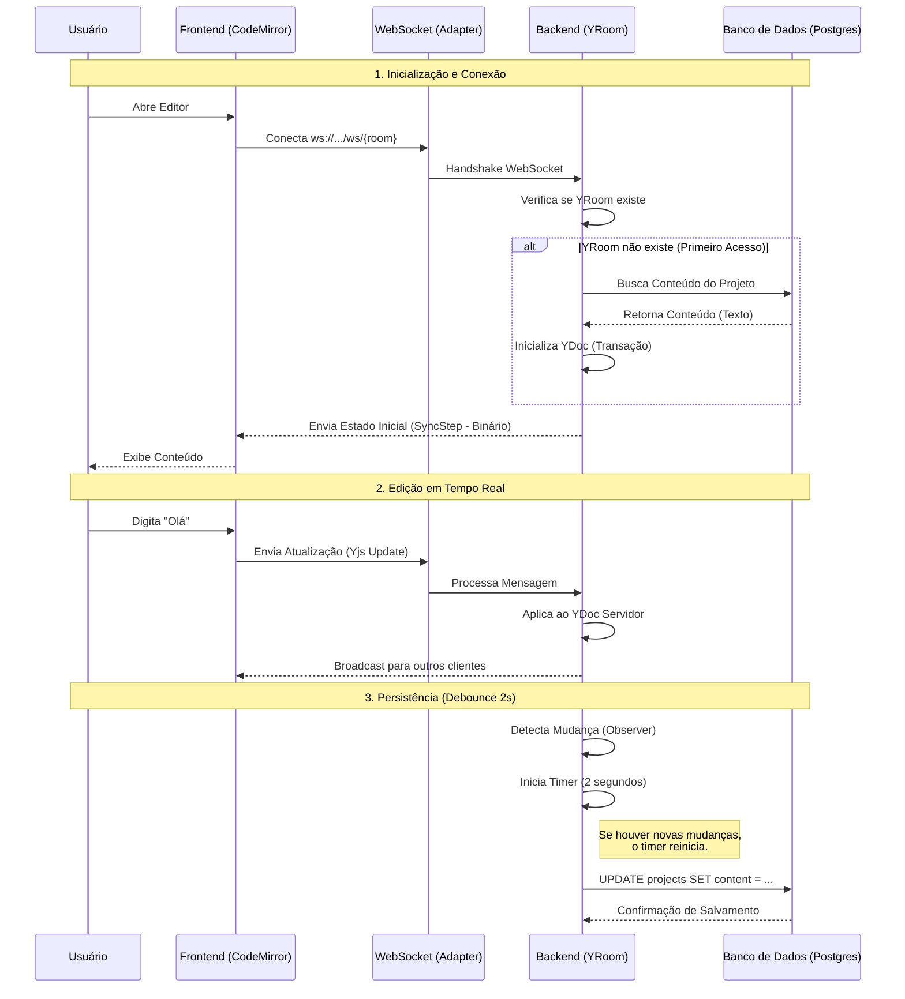

# Arquitetura de Colaboração em Tempo Real (Autoridade no Servidor)

## Visão Geral

Este documento detalha a arquitetura adotada para o editor colaborativo em tempo real do SciAgent (Artigo Científico). Migramos de um modelo centrado no cliente para um modelo de **Autoridade no Servidor** (Server-Authoritative) utilizando **Yjs**, **ypy-websocket** e **FastAPI**.

Essa arquitetura garante que o servidor seja a única fonte de verdade (source of truth) para o estado do documento, gerenciando persistência, sincronização e resolução de conflitos, enquanto o frontend permanece como uma camada de apresentação leve.

## O Problema

Anteriormente, a aplicação sofria de vários problemas críticos:

1.  **Condições de Corrida (Race Conditions)**: O frontend tentava salvar o documento no banco de dados via REST API (`PUT`) enquanto simultaneamente sincronizava com o Yjs. Isso levava a cenários de "última escrita vence", onde um salvamento podia sobrescrever mudanças em tempo real de outro usuário.
2.  **Estado Inconsistente**: Novos usuários ao entrar na sessão muitas vezes recebiam um documento vazio ou desatualizado porque o estado inicial não era sincronizado corretamente do banco para a sala Yjs.
3.  **Lógica Complexa no Frontend**: O frontend estava sobrecarregado gerenciando timers de salvamento, debounce e decidindo quando enviar atualizações para o servidor.
4.  **Instabilidade de Conexão**: A lógica de WebSocket era frágil, causando desconexões frequentes e erros 403 devido a incompatibilidades de URL.

## A Solução: Yjs com Autoridade no Servidor

Adotamos uma abordagem onde o **Servidor (Backend)** gerencia o `YDoc` (o documento compartilhado Yjs) e é responsável por salvá-lo no banco de dados.

### Componentes Chave

- **Frontend**: CodeMirror 6 com `y-codemirror.next` e `y-websocket` (cliente). Ele conecta ao servidor e apenas renderiza o estado que recebe. Ele **não** realiza chamadas HTTP para salvar o conteúdo do documento.
- **Backend**: FastAPI com `ypy-websocket` e `y-py`. Ele hospeda o `YRoom`, mantém o `YDoc` em memória e gerencia as conexões WebSocket.
- **Persistência**: O backend observa o tipo compartilhado 'codemirror' no `YDoc`. Quando ocorrem mudanças, ele aplica um _debounce_ (espera) e salva o estado atual no banco de dados PostgreSQL.

## Fluxo de Dados da Arquitetura

O diagrama abaixo ilustra o fluxo de dados desde a inicialização até a persistência.

### Detalhes do Fluxo

#### 1. Inicialização (Backend)

- O `CollaborationService` é iniciado.
- Ele mantém um dicionário em memória com as instâncias ativas de `YRoom`.

#### 2. Conexão do Cliente (Frontend -> Backend)

1.  **Frontend**: O usuário abre o editor. O `EditorPage.tsx` inicializa um `WebsocketProvider` apontando para `ws://.../api/v1/editor/{project_id}/ws/{room_name}`.
2.  **Handshake**: O endpoint `websocket_endpoint` aceita a conexão.
3.  **Carregamento da Sala**:
    - O backend verifica se existe um `YRoom` para o `project_id`.
    - Se não, cria um e dispara `_load_room_from_db`.
    - **Transação**: O backend busca o conteúdo mais recente no DB. Ele usa uma transação Yjs (`room.ydoc.transact`) para popular o texto `codemirror`.
    - **Pronto**: A sala é marcada como `ready`.
4.  **Sincronização**: O `YRoom` troca os passos de sincronização (Sync Steps) com o cliente. O cliente recebe o conteúdo inicial **via protocolo Yjs**, e não por uma chamada de API separada.

#### 3. Atualizações em Tempo Real

1.  **Usuário Digita**: O usuário digita no CodeMirror.
2.  **Propagação**: `y-codemirror` atualiza o YDoc local. `y-websocket` envia o vetor de atualização (binário) para o servidor via WebSocket.
3.  **Merge no Servidor**: O `YRoom` no servidor recebe a atualização e aplica ao seu `YDoc` local.
4.  **Broadcast**: O servidor reencaminha a atualização para todos os outros clientes conectados.

#### 4. Persistência (Servidor -> DB)

1.  **Observação**: O `CollaborationService` possui um observador (observer) no tipo compartilhado `codemirror`.
2.  **Debounce**: Quando uma mudança é detectada, um timer de 2 segundos é iniciado.
3.  **Salvamento**: Quando o timer expira (sem novas mudanças), o servidor extrai o texto do `YDoc` (`ytext.toString()`) e executa um update SQL na tabela `projects`.

## Implementação Técnica

### Backend (`editor.py` & `collaboration.py`)

- **`FastAPIwebsocketAdapter`**: Criamos uma classe adaptadora para conectar o objeto `WebSocket` do FastAPI com a interface esperada pelo `ypy-websocket` (implementando o iterador assíncrono `__aiter__`/`__anext__`).
- **`_load_room_from_db`**: Usa `ytext.extend(txn, content)` dentro de uma transação. Isso corrige o erro onde o texto não era carregado corretamente se não passássemos a transação explicitamente.

### Frontend (`EditorPage.tsx`)

- **Simplificado**: Toda a lógica manual de `saveContent`, `saveStatus` e timers foi removida.
- **Sincronização Pura**: O editor confia inteiramente no provider `y-websocket`.

## Benefícios

- **Confiabilidade**: Fim das escritas perdidas. O estado mesclado (merged) do Yjs é o que é salvo.
- **Simplicidade**: O frontend ficou "burro" (apenas renderiza); o backend ficou "inteligente" (gerencia o estado).
- **Performance**: Apenas pequenos vetores binários são transferidos durante a edição, e não o texto inteiro.
- **Suporte Offline**: O Yjs suporta edição offline (podemos adicionar `y-indexeddb` no futuro), sincronizando automaticamente quando a conexão voltar.
